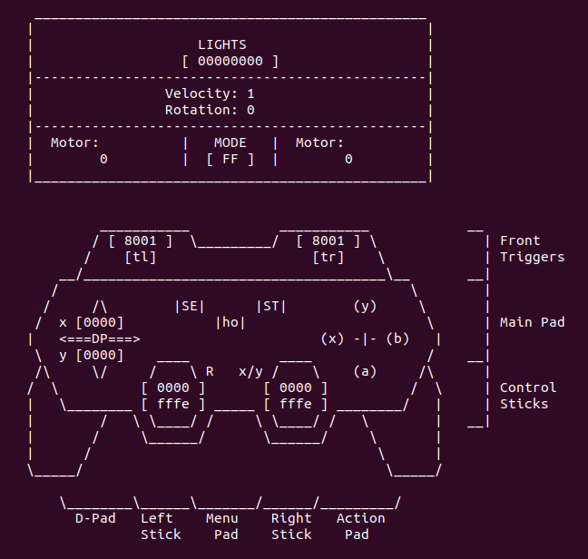

# HBA TANK Demo

Pilot the HBRC FPGA Bot like a toy & Demonstrate its Virtual Peripherals...

## Program Info
* Opens several sockets to the HBA Daemon for input/output.
* Listens for input events from a Gamepad.
* Calculates Velocity and Rotation from those inputs.
* Calculates Motor Power and Direction from the Velocity and Rotation values.
* Performs both Swing turns and Point turns, depending on radius of turn.
* Updates the LEDs.
* Updates the Motors.

The application uses a blocking Event read loop for Gamepad input.

## Drivers Manual

Use a sceen size of at least __100x40__ for best display results!

* Front (L/R) Triggers are differential speed controls, and drives like a Tank.
* Front (L/R) buttons toggle Reverse for Trigger controls.
* Right Joystick for full X/Y speed and direction control. Swing turns to gentle radius turns.  Point turns for sharper radius turns.
* Left Joystick for in-place Point turns.
* Action Pad (N,S,E,W) controls Headlights and Turn Signals.
* Center Button stops bot, and exits program.

## Screenshot

*Enjoy.* - AGM - 8/2019
