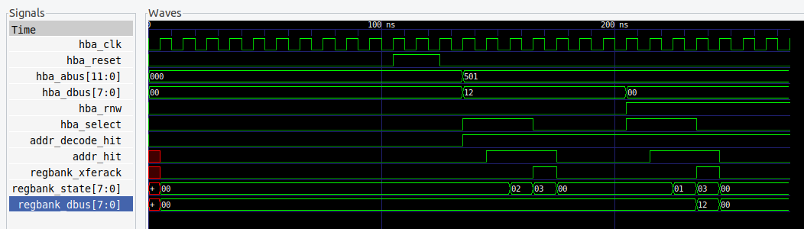

# hba_reg_bank_tb

## Description

A testbench that test the hba_reg_bank module.
It instantiates the module with peripheral address 5.
It then writes the value 8'h21 to reg1.
It then read the value of reg1.

The testbench uses iverilog and gtkwave.  It has a Makefile which
has the following targets:

* __compile__ : Default target. Compiles without running the simulation.  Good way to
  test for syntax errors.
* __run__ : Runs the simulation. Prints "debug" messages
  Generates a waveform vcd file.
* __view__ : Runs gtkwave and displays the waveform.
* __clean__ : Remove the generated files
* __help__ : Displays iverilog help

## Output

```
> make run
...
vvp hba_reg_bank.vvp
VCD info: dumpfile hba_reg_bank.vcd opened for output.

***WRITE to reg1=0x12
hba_abus: 501
hba_dbus: 12
periph_addr: 5
PERIPH_ADDR: 00000005
addr_decode_hit: 1
reg1: 12

addr_hit: 0, Done so should be 0.

***READ reg1 from regbank_dbus
regbank_dbus: 12
```

```
> make view
```




