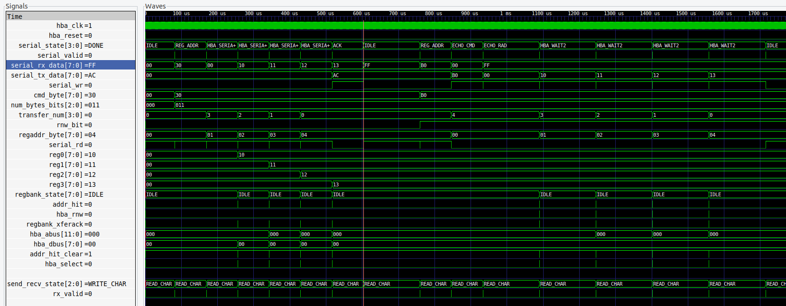

# serial_test_tb

## Description

This testbench simulates a host (raspberry pi)
sending read and write packets over an rs232
serial connection.  It test the protocol
specified in the 
[Serial Interface](/home/brandonb/Projects/fpga_class/peripherals/serial_fpga/uart_tb)
document.

The testbench uses iverilog and gtkwave.  It has a Makefile which
has the following targets:

* __compile__ : Default target. Compiles without running the simulation.  Good way to
  test for syntax errors.
* __run__ : Runs the simulation. Prints "debug" messages
  Generates a waveform vcd file.
* __view__ : Runs gtkwave and displays the waveform.
* __clean__ : Remove the generated files
* __help__ : Displays iverilog help

## Stimulus file

The test command packets are in the file
[serial_test.dat](https://github.com/hbrc-fpga-class/peripherals/blob/master/projects/serial_test/serial_test_tb/serial_test.dat)

## Output

```
> make run
...
vvp serial_test.vvp
VCD info: dumpfile serial_test.vcd opened for output.

                  55: BEGIN write_test
                  55: send cmd=30
                  95: send regaddr=00
               86875: send data0=10
              173685: send data1=11
              260485: send data2=12
              347295: send data3=13
              681525:   recv read_ack=ac

              681525: END write_test

              681525: BEGIN read_test
              681525: send cmd=b0
              681565: send regaddr=00
              763955: send dummy=ff
             1011385:   recv echo_cmd=b0
             1011385: send dummy=ff
             1167635:   recv echo_regaddr=00
             1167635: send dummy0=ff
             1323885:   recv read_data=10
             1323885: send dummy1=ff
             1480135:   recv read_data=11
             1480135: send dummy2=ff
             1636385:   recv read_data=12
             1636385: send dummy3=ff
             1792635:   recv read_data=13

             1792635: END read_test
```


```
> make view
```




