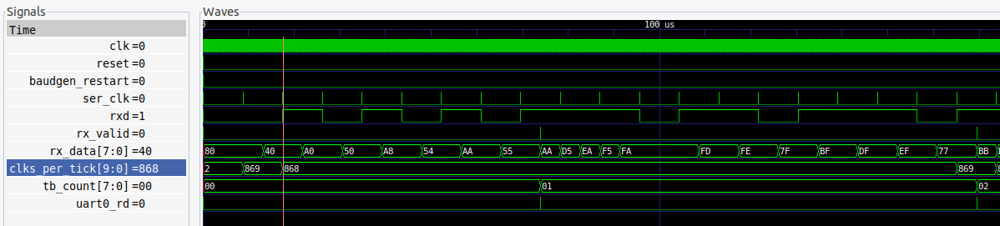

# uart_tb

## Description

This testbench test the baudgen and read
functionality of the uart.
The test drives the rxd pin sending the
characters AA and BB.  The testbench test
that these two characters are interpreted correctly.

The testbench uses iverilog and gtkwave.  It has a Makefile which
has the following targets:

* __compile__ : Default target. Compiles without running the simulation.  Good way to
  test for syntax errors.
* __run__ : Runs the simulation. Prints "debug" messages
  Generates a waveform vcd file.
* __view__ : Runs gtkwave and displays the waveform.
* __clean__ : Remove the generated files
* __help__ : Displays iverilog help

## Output

```
> make run
...
vvp uart.vvp
VCD info: dumpfile uart.vcd opened for output.
rx_data: aa, expected: aa, PASS
rx_data: bb, expected: bb, PASS
CLK_FREQUENCY:   100000000, BAUD:      115200
clks_per_tick:  869
```

The clock rate is set at 100 MHz.
So clks_per_ticks * BAUD = 100.1 MHz. So pretty close.

```
> make view
```




